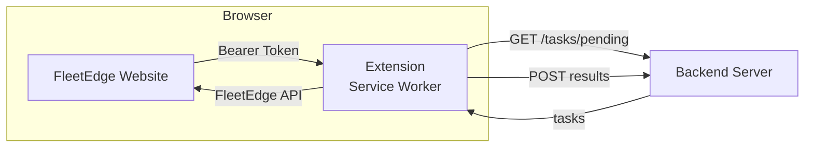
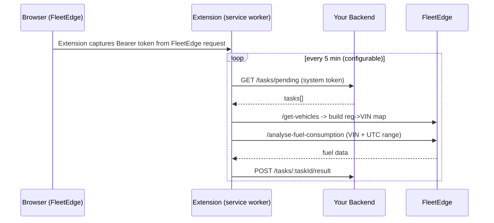

# FleetEdge Fuel Monitor — Chrome Extension 🚗⛽️

A Chrome Extension (Manifest V3) that **passively captures FleetEdge authentication tokens** from the user's browser session and uses them to fetch fuel-consumption data on behalf of your backend.
It replaces browser automation scrapers — **no Playwright**, **no headless logins** — the extension does the API calls from the logged-in user’s browser and **only** sends aggregated results to your server.
**API Calls via Tab Injection:** To bypass Chrome's service-worker Origin restrictions, the extension injects `fetch()` calls directly into the open FleetEdge browser tab using `chrome.scripting.executeScript`. This ensures requests carry the correct `Origin` and `Referer` headers plus full session cookies — appearing as legitimate FleetEdge portal requests.
---

## Key ideas 🧠

* The FleetEdge token **never leaves the browser**.
* The extension polls your backend for tasks, queries FleetEdge with the captured token, and POSTs results back to your backend.
* Works as a **privacy-preserving** in-browser scraper that runs only when the user has an active session.

---

# How it works (visual) 🔁



Sequence view:



---

# Table of contents 📚

* [Installation](#installation-)
* [API Architecture (Tab Injection)](#api-architecture-tab-injection-)
* [First-time setup](#first-time-setup-)
* [Backend integration (required endpoints)](#backend-integration-required-endpoints-)
* [CORS configuration](#cors-configuration-)
* [Database suggestions](#suggested-database-schema-mongodb-)
* [Environment variables](#environment-variables-)
* [Development](#development-)
* [Testing & Quality Gates](#testing--quality-gates-)
* [Troubleshooting](#troubleshooting-)
* [Security & privacy](#security--privacy-)
* [Contributing & license](#contributing--license-)

---

# Installation 🛠️

```bash
cd extension
npm install
cp .env.example .env
# Edit .env (VITE_BACKEND_BASE_URL etc)
npm run build
```

Load in Chrome:

1. Go to `chrome://extensions/`
2. Enable **Developer mode**
3. Click **Load unpacked** → select the `dist/` folder

For dev (hot reload popup):

```bash
cd extension
npm run dev
```

Load the extension pointing at the project root (not `dist/`) when using `npm run dev`. Background service worker changes require refreshing the extension in `chrome://extensions/`.

---

# API Architecture (Tab Injection) 🔌

## The Problem: Why Tab Injection?

Chrome's Manifest V3 service workers **cannot spoof the `Origin` header**. When the FleetEdge extension service worker makes a direct fetch to FleetEdge's API, Chrome sets `Origin: chrome-extension://[extension-id]`, which FleetEdge rejects with a 403 Forbidden.

## The Solution: Execute Fetch Inside the Browser Tab

The extension uses **`chrome.scripting.executeScript`** to inject and run the fetch call *inside* the open FleetEdge browser tab, not from the service worker. This means:

- The request originates from `https://fleetedge.home.tatamotors`, so `Origin` is correct
- The browser's full session cookie jar is available via `credentials: 'include'`
- The fetch returns real FleetEdge API responses without 403 errors

### Code Flow

```javascript
// In service worker (extension/src/background/fleetedgeApi.js)
async function fleetFetch(path, token, body) {
  const tab = await getFleetEdgeTab(); // Must have FleetEdge tab open
  const results = await chrome.scripting.executeScript({
    target: { tabId: tab.id },
    func: async (fetchUrl, bearerToken, requestBody) => {
      // This func runs INSIDE the FleetEdge tab
      const res = await fetch(fetchUrl, {
        method: 'POST',
        headers: { 'Authorization': `Bearer ${bearerToken}` },
        credentials: 'include', // Use browser's session cookies
        body: JSON.stringify(requestBody),
      });
      return { ok: res.ok, status: res.status, text: await res.text() };
    },
    args: [url, token, body],
  });
  // Parse and return result from the tab
}
```

### Required Permissions

The [manifest.json](extension/manifest.json) includes:

```json
"permissions": ["webRequest", "storage", "alarms", "notifications", "scripting", "tabs"]
```

- `scripting` — inject scripts into pages
- `tabs` — query for open FleetEdge tabs

### User Experience

- **FleetEdge tab must stay open** in the browser (can be in background/hidden)
- If user closes the FleetEdge tab, the extension cannot poll or fetch data
- Extension popups alert users to "Keep FleetEdge open in a tab" if it detects no tab

---

# First-time setup (UX) ✅

1. Click the extension icon → **Settings** (⚙️)
2. Enter your **backend URL** and **backend auth token** (system token)
3. Open FleetEdge in a tab and log in normally
4. The extension captures the token automatically (you’ll see a green badge)
5. Use **Refresh Vehicles** to populate registration→VIN map
6. Use **Poll Tasks Now** to test a single cycle

---

# Backend integration (required endpoints) 🔌

The extension authenticates to your backend with a **system token** you configure in the extension. Each request includes:

```
Authorization: Bearer <system_token>
Content-Type: application/json
```

Implement the following endpoints:

---

## `GET /tasks/pending` — required

Return `tasks: []` or a list of pending tasks. Use **explicit range** (recommended) or **point-in-time** (legacy).

**Explicit range example response**

```json
{
  "tasks": [
    {
      "id": "task_001",
      "vehicle_number": "MH12AB1234",
      "from_date": "2026-02-14",
      "from_time": "03:20",
      "to_date": "2026-02-18",
      "to_time": "14:50"
    }
  ]
}
```

**Point-in-time example**

```json
{
  "tasks": [
    {
      "id": "task_002",
      "vehicle_number": "GJ01CD5678",
      "refuel_date": "2026-02-21",
      "refuel_time": "14:30"
    }
  ]
}
```

**Notes**

* If both explicit and point-in-time fields exist, explicit range takes precedence.
* Always return an array (empty when nothing to do).
* Tasks should be unique by `id`.

---

## `POST /tasks/:taskId/result` — required

Called when extension obtains fuel data.

**Payload example**

```json
{
  "task_id": "task_001",
  "results": [
    {
      "vin": "MAT828113S2C05629",
      "registration_number": "MH12AB1234",
      "fuel_used": 45.2,
      "distance_covered": 320.5,
      "avg_speed": 42.3,
      "max_speed": 85.0,
      "idle_duration": 7200,
      "running_duration": 27400,
      "stoppage_duration": 3600,
      "mileage": 7.09
    }
  ],
  "submitted_at": "2026-02-21T09:45:12.345Z"
}
```

**Your backend should**

1. Insert the results into DB (or update)
2. Mark task as `completed`
3. Return `{ "success": true }`

---

## `POST /tasks/:taskId/error` — required

If a task fails, extension reports the error here.

**Payload example**

```json
{
  "task_id": "task_001",
  "error": "VIN not found for registration: MH12AB1234",
  "reported_at": "2026-02-21T09:45:12.345Z"
}
```

**Your backend should**

* Log the error
* Mark `status: failed` (or `retry`)
* Return `{ "success": true }`

---

## `POST /fuel-data/ingest` — optional

Manual-query results from popup (distinct from task flow).

**Payload example**

```json
{
  "source": "manual_query",
  "vin": "MAT828113S2C05629",
  "registration": "MH12AB1234",
  "identifier": "MH12AB1234",
  "fleetId": "fleet-abc-123",
  "fromIst": "2026-02-20 08:00",
  "toIst": "2026-02-21 18:00",
  "fromUtc": "2026-02-20T02:30:00.000Z",
  "toUtc": "2026-02-21T12:30:00.000Z",
  "fetchedAt": "2026-02-21T09:45:12.345Z",
  "resultCount": 3,
  "results": [ /* ... */ ],
  "rawResponse": {}
}
```

---

# CORS configuration 💡

Allow Chrome extensions and dev server origin:

```js
const cors = require('cors');

app.use(cors({
  origin: [
    /^chrome-extension:\/\//, // allow all extensions
    'http://localhost:5173'    // vite dev server
  ],
  credentials: true
}));
```

---

# Suggested DB schema (MongoDB) 🗄️

`refuel_tasks`:

```js
{
  _id: ObjectId,
  vehicle_number: "MH12AB1234",
  from_date: "2026-02-14",
  from_time: "03:20",
  to_date: "2026-02-18",
  to_time: "14:50",
  status: "pending",
  created_at: ISODate,
  completed_at: ISODate,
  last_error: "string",
  error_at: ISODate
}
```

`fuel_consumption_data`:

```js
{
  _id: ObjectId,
  task_id: "task_001",
  vin: "MAT828113S2C05629",
  registration_number: "MH12AB1234",
  fuel_used: Number,
  distance_covered: Number,
  avg_speed: Number,
  max_speed: Number,
  idle_duration: Number,
  running_duration: Number,
  stoppage_duration: Number,
  mileage: Number,
  submitted_at: ISODate,
  created_at: ISODate,
  source: "task" | "manual_query"
}
```

---

# Environment variables 🧭

Copy `.env.example` → `.env` and edit.

Important keys (Vite prefix used for extension build):

```
VITE_BACKEND_BASE_URL=http://localhost:3000/api
VITE_POLL_INTERVAL_MINUTES=5
VITE_INTER_TASK_DELAY_MS=500
VITE_VIN_CACHE_TTL_HOURS=24
VITE_TOKEN_EXPIRY_BUFFER_SECONDS=60
VITE_SEARCH_WINDOW_MINUTES=30
VITE_LOG_RETENTION_COUNT=500
VITE_MAX_RETRY_ATTEMPTS=2
```

---

# Development 🧩

* `npm run dev` — dev mode (hot reload for popup)
* `npm run build` — production build → `dist/`
* `npm test` — run Vitest unit tests

> Note: Background service worker must be reloaded from `chrome://extensions/` after code changes.

---

# Testing & Quality Gates 🧪

**186 tests** across 9 files — run with:

```bash
cd extension
npm test              # Run all tests
npm run test:watch    # Watch mode
npm run test:coverage # With coverage report
```

| File | Tests | Coverage |
|------|------:|----------|
| `utils.test.js` | 16 | Pure functions: retries, JWT, time conversion |
| `backendApi.test.js` | 19 | Backend auth, fetch, error codes |
| `fleetedgeApi.test.js` | 20 | Tab injection, API errors |
| `taskPoller.test.js` | 12 | Poll cycles, VIN resolution |
| `integration.test.js` | 13 | End-to-end flows |
| `telemetry.test.js` | 45 | LEMU telemetry collector |
| `logger.test.js` | 6 | Buffered logging |
| **`edge-cases-utils.test.js`** | **46** | **Error boundaries (pure functions)** |
| **`edge-cases-integration.test.js`** | **9** | **Module-level edge cases** |

> **55 edge-case tests** cover null JWT payloads, special-character registrations, timeout handling, 401 auth clearing, VIN fallback matching, and zero fuel values. These tests caught and fixed 2 real bugs (`normalizeRegistration` and `checkTokenExpiry`). See [TESTING.md](extension/TESTING.md) for details.

Pre-push hooks (Husky) run `npm run lint` + `npm test` automatically — push is blocked if either fails.

---

# Troubleshooting 🐞

| Problem              | Quick fix                                                                                              |
| -------------------- | ------------------------------------------------------------------------------------------------------ |
| Token not capturing  | Visit FleetEdge Reports page so extension sees an API call with `Authorization` header                 |
| Token expired        | Log into FleetEdge again — token is captured automatically                                             |
| Vehicle count = 0    | Click **Refresh Vehicles**; ensure token valid                                                         |
| Tasks not processing | Verify backend URL and system token in Settings; check service worker console (`chrome://extensions/`) |
| Build fails          | Delete `node_modules` + `package-lock.json`, run `npm install`. Use Node 18+                           |

---

# Security & privacy 🔐

* **FleetEdge token** is stored in `chrome.storage.local` and **never** sent to your backend.
* **Backend token** is the only token the extension sends to your backend. You control how validation is done (JWT, DB lookup, etc.).
* The extension only requests `webRequest` permission to read Authorization headers for FleetEdge domains.
* Logs in extension are batched and kept local; you control retention via `VITE_LOG_RETENTION_COUNT`.

---

# Packaging & publishing 🧾

* Verify `manifest.json` (MV3) and icons exist (16/48/128)
* Test on Chrome Canary / stable, check extension permissions and service worker lifecycle
* Consider a short README.md and changelog for the Chrome Web Store listing

---

# Contribution & Code of Conduct 🤝

PRs welcome. Keep changes small and add unit tests where possible (Vitest). Please follow the existing coding style.

---

# License ⚖️

Choose a license (e.g. MIT) and add `LICENSE` file to the repo.

---

# Quick copy-paste README header for your repo (optional)

```md
# FleetEdge Fuel Monitor — Chrome Extension 🚗⛽️

Passive browser-based scraper for FleetEdge that captures in-browser tokens and fetches fuel-consumption data for your backend.

See the full README for installation, backend API spec, development, and security notes.
```

---
