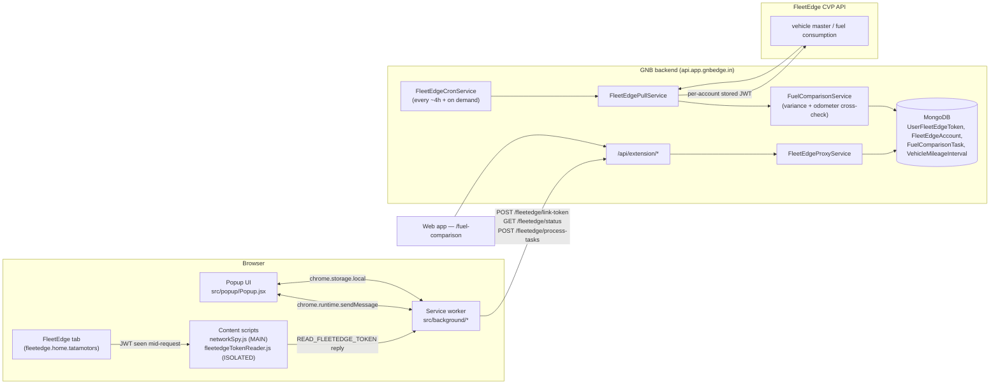
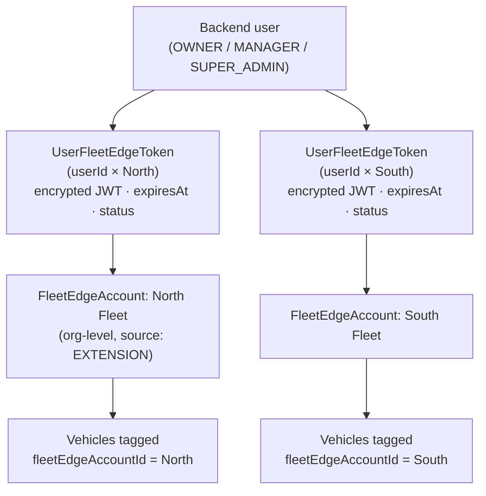
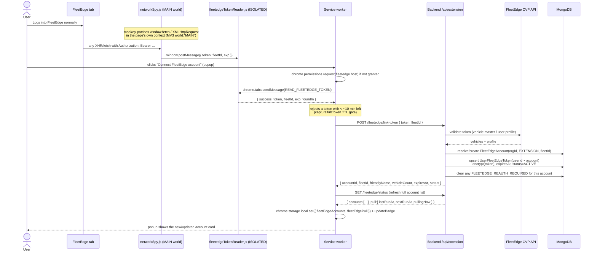
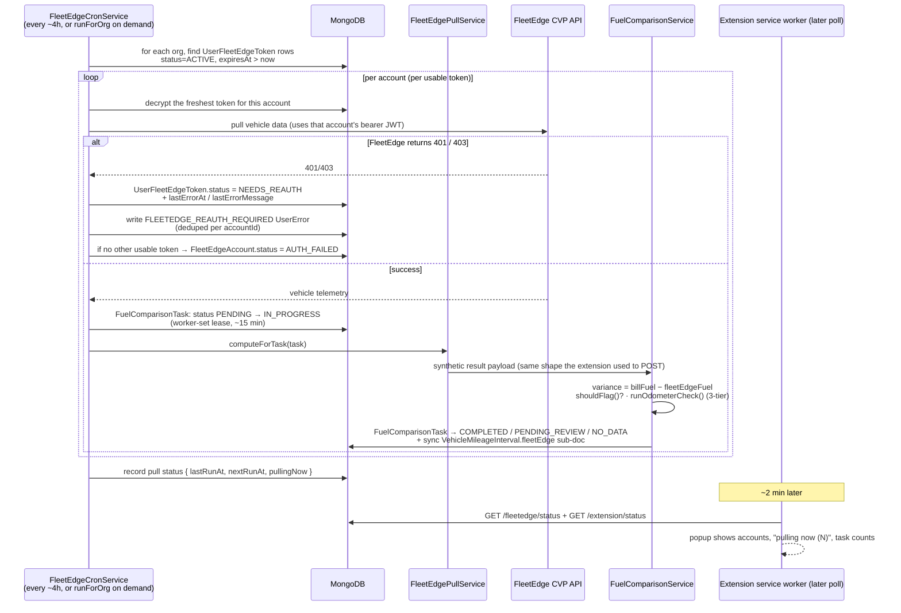
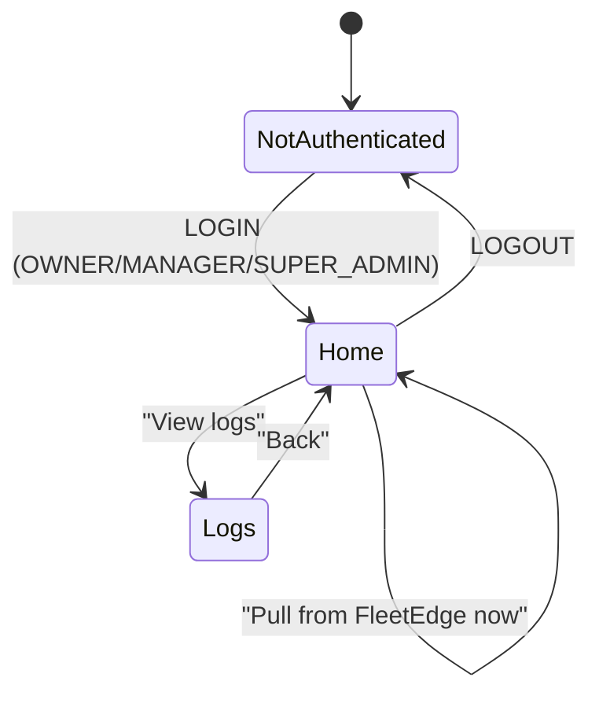

# gnbedge — Chrome Extension

A Manifest V3 Chrome extension that links your **FleetEdge** telematics sessions to the **GNB** backend so the backend can audit fuel consumption against billed fuel — automatically, server-side, for **multiple FleetEdge accounts per user**.

> **Version:** see [`CHANGELOG.md`](./CHANGELOG.md) and `manifest.json`. The extension is on the `0.x` line. Older docs referenced a "v2.0.0 architecture" — that was an internal milestone, not a published release; the architecture it describes (backend-direct, content-script token capture) is what's in use today.

---

## TL;DR — what this extension is and isn't

| It **is** | It **isn't** |
|---|---|
| A thin **token provider** — it reads your FleetEdge session JWT and hands it to *your* org's backend. | A FleetEdge API client. The extension never calls FleetEdge's data APIs. |
| A **status display** — account cards, pull status, task counts, expiry warnings. | A data processor. Variance/odometer/flagging logic all runs server-side. |
| **Multi-account** — link North Fleet, South Fleet, etc., each with its own token. | Single-account. There is no "the" FleetEdge connection — there are N. |
| **Low-permission** — `storage`, `alarms`, `notifications`, one backend host, FleetEdge host requested at runtime. | A broad-permission extension. No `tabs`, no `webRequest`, no `scripting`. |

The backend (`FleetEdgeProxyService` + `FleetEdgeCronService` + `FleetEdgePullService`) does all the FleetEdge work: it pulls each linked account's vehicle data on a cron (default every ~4 h, configurable via `FLEETEDGE_PULL_INTERVAL_HOURS`) and on demand, computes fuel variance and odometer cross-checks, and surfaces results in the web app. The extension only has to be open briefly — to (re)link a token. The FleetEdge tab does **not** need to stay open between pulls.

---

## Architecture at a glance



**The one-sentence version:** the extension scrapes the FleetEdge bearer token from the page and POSTs it to your backend; the backend stores it (encrypted), uses it on a schedule to pull FleetEdge data, computes the audit, and shows you the results — in the web app and, at a glance, in the extension popup.

---

## The multi-account model

One backend user can be linked to several FleetEdge fleet accounts. Each link is its own row.



- **`FleetEdgeAccount`** — org-level record for a FleetEdge fleet/tenant. Holds the human-friendly name and the account-level status. Vehicles are tagged to it (`vehicle.fleetEdgeAccountId`), so the cron knows *which vehicles* a given token unlocks.
- **`UserFleetEdgeToken`** — one row per `(userId, fleetEdgeAccountId)`. Holds the **AES-256-GCM-encrypted** FleetEdge JWT (key: `FLEETEDGE_CRED_KEY`), the `expiresAt` (from the JWT's `exp` claim), and a lifecycle `status`:
  - `ACTIVE` — usable. The cron picks the freshest `ACTIVE`, non-expired token for the account.
  - `NEEDS_REAUTH` — `exp` passed **or** FleetEdge returned 401/403. The cron skips it; the popup shows the card red; the user must reconnect.
  - `REVOKED` — the user manually disconnected this account.
- **Independence:** if North's token expires while South's is fine, only North goes `NEEDS_REAUTH`. South keeps pulling normally. If two users both link the same fleet, the cron uses whichever token is freshest — that account only goes `NEEDS_REAUTH` when *no* usable token remains.

---

## Data flow 1 — linking (or reconnecting) a FleetEdge account



**Idempotent re-link.** Clicking "Connect" / "Reconnect" for a fleet you've already linked **updates** the existing `UserFleetEdgeToken` row (looked up by `userId × accountId`) — it overwrites `token`, `expiresAt`, `linkedAt`, sets `status = ACTIVE`, clears the account's `FLEETEDGE_REAUTH_REQUIRED` UserError, and flips `FleetEdgeAccount.status` back to `ACTIVE` if it was `AUTH_FAILED`. No matter how many times you click, you end up with exactly one fresh row — never duplicates. That's also the entire backend job of the "Reconnect" button.

**Why the token is encrypted (and why it's encryption, not a hash).** A hash is one-way — you can verify a value but never recover it. The backend has to *send* the JWT to FleetEdge on every pull, so it needs the original back: that requires reversible **AES-256-GCM** (`encrypt`/`decrypt` in `app/utils/crypto.js`). The token is a live credential — anyone who could read the DB (a leaked backup, a stolen dump) would otherwise be able to call FleetEdge *as that user* until the token expires. Storing ciphertext + holding the key separately (`FLEETEDGE_CRED_KEY` in env, never in the DB) makes the DB contents alone worthless. Each token row is encrypted independently (fresh random IV per `encrypt()`), so one leaking doesn't help with another. Key rotation is supported via `FLEETEDGE_CRED_KEY_PREVIOUS` (decrypt-only fallback).

---

## Data flow 2 — the backend pull cycle (cron + on-demand)

This is where the actual audit happens. The extension is not involved at all — it just *displays* the outcome on the next status poll.



**"How do I know the backend is pulling *right now*?"** While the cron/on-demand worker processes a `FuelComparisonTask` it sets `status = IN_PROGRESS` *before* the FleetEdge call, then `COMPLETED` / `PENDING_REVIEW` / `NO_DATA` after. The popup's connectivity summary shows a live "pulling now (N)" indicator (count of tasks currently `IN_PROGRESS`), and the metrics grid's "In Progress" tile drains as entries complete. A crashed worker can't leave a task stuck forever — `expireStaleInProgressTasks` resets a stale lease, increments `staleResetCount`, and at the cap terminal-fails the task.

**Task outcomes:**

| Status | Meaning |
|---|---|
| `PENDING` | created from a FULL_TANK fuel log + closed mileage interval; waiting for the next pull |
| `IN_PROGRESS` | the backend is fetching/computing this one *right now* |
| `COMPLETED` | computed; variance + flag stored on the linked `VehicleMileageInterval` |
| `PENDING_REVIEW` | held for a manager — low OCR confidence on the odometer photo, or an implausible odometer delta |
| `NO_DATA` | FleetEdge returned no telemetry for the interval (no fake "100% variance"); gets a capped `nextRetryAt` backoff (+6 h → +1 d → +3 d → +7 d → stop) |
| `FAILED` / `EXPIRED` | terminal — exceeded retries / lease resets |

---

## Data flow 3 — a token expires (~24 h) and the re-auth loop

```mermaid
sequenceDiagram
    participant Cron as Backend cron
    participant DB as MongoDB
    participant SW as Service worker (statusPoll alarm, ~2 min)
    actor User
    participant FE as FleetEdge tab

    Note over DB: predictive signal — token.expiresAt <= now + buffer<br/>definitive signal — FleetEdge 401/403 on a pull
    Cron->>DB: token → NEEDS_REAUTH; FLEETEDGE_REAUTH_REQUIRED UserError (deduped)
    SW->>DB: GET /fleetedge/status
    DB-->>SW: account.status = NEEDS_REAUTH
    SW->>SW: card → red "Expired — reconnect"<br/>badge → amber/red with count<br/>chrome.notifications.create (one-shot, deduped via _notifiedExpiredAccounts)
    Note over Cron: cron SKIPS NEEDS_REAUTH tokens — no re-hammering FleetEdge,<br/>no duplicate UserErrors
    User->>FE: opens that fleet's FleetEdge tab, logs in
    User->>SW: clicks "Reconnect" on the card
    Note over SW: same capture flow as link-token;<br/>TTL gate rejects an already-dead token before posting
    SW->>DB: POST /fleetedge/link-token → token re-upserted, status=ACTIVE,<br/>UserError cleared, FleetEdgeAccount back to ACTIVE
    SW->>SW: card → green; notification cleared
```

**Optional silent refresh.** If the status poll sees an account *about to* expire **and** a FleetEdge tab for that fleet is open, the service worker attempts a quiet re-capture + `link-token` before bothering the user — but only once per poll cycle, and only if the re-captured token's `exp` advanced by a meaningful margin (otherwise it stops and shows the notification). Strictly better UX than always prompting.

---

## The popup UI



**Home (authenticated)**, top → bottom:

- **User bar** — avatar (initial), name, role chip, "Sign out".
- **Connectivity summary** — *"2 connected · 1 needs re-auth · last pull 14:05 · next ~18:05"*, with a live "pulling now (N)" indicator (scan animation) when the backend is mid-pull.
- **Account cards** (0..N) — each shows the friendly name + fleet id (monospace), a **status chip** — `Connected` (emerald) / `Expires in 3h` (amber, live HH:MM:SS countdown) / `Expired — reconnect` (red) — vehicle count, "last pull HH:MM", and a context action: `Reconnect` (when expiring/expired) or a `⋯` menu (Rename / Disconnect). Empty state when none: "Connect your first FleetEdge account" with a hint that a logged-in FleetEdge tab must be open.
- **Primary actions** — `Connect another FleetEdge account` (full-width, primary), `Pull from FleetEdge now` (secondary; disabled with a tooltip when there's no `ACTIVE` account).
- **Task metrics grid** — Pending · In Progress · Completed · Flagged · No Data, with a footer line ("all caught up" / "N awaiting pull").
- **Footer** — `View logs`, `Clear data` (danger, with confirm).
- **Toast** — bottom, auto-dismiss ~3 s, for action results ("Pulled 12 tasks", "Couldn't reach FleetEdge tab", …).

**Toolbar badge:** green `✓` when every account is healthy, amber `!` when any account is expiring soon, red `<N>` when N accounts have expired.

---

## Message-passing surface (popup ↔ service worker)

All extension I/O goes through the service worker — the popup never makes a network call or touches a chrome API directly. Messages via `chrome.runtime.sendMessage`:

| Message | Direction | What it does |
|---|---|---|
| `LOGIN { emailOrMobile, password }` | popup → SW | `POST /extension/auth/login`; stores `authToken`/`authUser` |
| `LOGOUT` | popup → SW | clears auth, invalidates status cache, clears badge |
| `GET_AUTH_STATUS` | popup → SW | `{ authenticated, user }` from storage |
| `GET_STATUS` | popup → SW | parallel fetch: backend status + FleetEdge status → `{ authenticated, user, backendUrl, fleetEdge:{ accounts, pull }, metrics:{ pending, inProgress, completed, flagged, noData }, backendStatus }` |
| `GET_FLEETEDGE_STATUS` | popup → SW | `{ accounts:[…], pull:{ lastRunAt, nextRunAt, pullingNow } }` (deduped/cached ~10 s) |
| `CONNECT_FLEETEDGE` | popup → SW | requests fleetedge host permission, captures the tab token, `POST /fleetedge/link-token`, returns the new account + refreshed list |
| `RECONNECT_ACCOUNT { accountId }` | popup → SW | same capture flow, targeted refresh of one account |
| `DISCONNECT_ACCOUNT { accountId }` | popup → SW | `POST /fleetedge/unlink/:accountId`; removes the card |
| `DISCONNECT_FLEETEDGE` | popup → SW | `POST /fleetedge/unlink` (all of the user's accounts) |
| `RENAME_ACCOUNT { accountId, friendlyName }` | popup → SW | optimistic local rename in `fleetEdgeAccounts` |
| `TRIGGER_PROCESS` | popup → SW | `POST /fleetedge/process-tasks` ("Pull from FleetEdge now") |
| `SET_BACKEND_URL { url }` | popup → SW | validates + stores `backendUrl` |
| `GET_LOGS` / `CLEAR_LOGS` | popup → SW | the background logger buffer |
| `CLEAR_ALL` | popup → SW | best-effort backend disconnect + wipes `authToken`/`authUser`/`backendUrl`/`fleetEdgeAccounts`/`fleetEdgePull` |
| `READ_FLEETEDGE_TOKEN` | SW → content script | reply `{ success, token, fleetId, exp, foundIn }` — the SW *ignores* this message type when it arrives the other way |

Plus LEMU telemetry queries (`GET_TELEMETRY`, `GET_TELEMETRY_STATS`, `GET_HEALTH`, `GET_BREADCRUMBS`, `CLEAR_TELEMETRY`, `FLUSH_TELEMETRY`) — unchanged this cycle; the telemetry layer predates the backend-direct architecture and is slated for its own rework.

---

## Backend API surface (consumed by the extension)

Base: `https://api.app.gnbedge.in/api/extension` (configurable; the dev default points at localhost). All but `/auth/login` require `Authorization: Bearer <backend_jwt>` and the role check (`OWNER` / `MANAGER` / `SUPER_ADMIN`).

### FleetEdge proxy

| Method | Endpoint | Request → Response |
|---|---|---|
| `POST` | `/fleetedge/link-token` | `{ token, fleetId }` → `{ data: { accountId, fleetId, friendlyName, vehicleCount, expiresAt, status } }` |
| `GET` | `/fleetedge/status` | → `{ data: { accounts: [{ accountId, fleetId, friendlyName, status, expiresAt, remainingSeconds, linkedAt, lastPullAt, lastErrorAt, lastErrorMessage, vehicleCount }], pull: { lastRunAt, nextRunAt, pullingNow } } }` |
| `POST` | `/fleetedge/unlink/:accountId` | → `{ data: { … } }` — unlink one account (`status = REVOKED`) |
| `POST` | `/fleetedge/unlink` | → `{ data: { … } }` — unlink **all** of the user's accounts |
| `GET` | `/fleetedge/vehicles` | → `{ data: { vehicleCount, vehicles: [{ vin, registration, type }] } }` (on-demand fetch) |
| `POST` | `/fleetedge/process-tasks` | → `{ data: <batch result> }` — processes pending tasks now, then fires an org-scoped `FleetEdgeCronService.runForOrg(orgId)` in the background |

### Auth / status / data

| Method | Endpoint | Notes |
|---|---|---|
| `POST` | `/auth/login` | `{ emailOrMobile, password }` → `{ data: { token, user } }`. Rate-limited: 10 attempts / 15 min. |
| `GET` | `/status` | task counts by status + flagged + `lastSyncAt` + `isUpToDate` for the org |
| `GET` | `/vehicles` | org vehicles with normalized registration numbers (VIN mapping helper) |
| `GET` | `/flagged`, `/comparisons` | paginated fuel-comparison records |
| `GET` | `/user-errors`, `PATCH` `/user-errors/:id/acknowledge` | user-visible errors (e.g. `BILLS_TOO_OLD`, `FLEETEDGE_REAUTH_REQUIRED`) |
| `GET` | `/fuel-comparison/pending-review`, `PUT` `/fuel-comparison/:taskId/review` | manager review queue |
| `GET`/`POST` | `/tasks/pending`, `/tasks/:id/result`, `/tasks/:id/error` | **Pipeline A (legacy)** — return `410` unless `FEATURE_EXTENSION_TASK_POLLING=true` on the backend. Kept for emergency re-enable only. |

---

## `chrome.storage.local` schema

| Key | Shape | Notes |
|---|---|---|
| `authToken` | `string` | backend JWT (~24 h) |
| `authUser` | `{ id, name, email, role, orgId }` | |
| `backendUrl` | `string` | override; defaults to the configured backend |
| `fleetEdgeAccounts` | `Array<{ accountId, fleetId, friendlyName, status, expiresAt, remainingSeconds, lastPullAt, … }>` | the multi-account list; the badge is derived from the worst account status |
| `fleetEdgePull` | `{ lastRunAt, nextRunAt, pullingNow }` | last/next cron run + in-progress count |

**Migration from the old single-account layout** (`fleetEdgeStatus`, `fleetEdgeFleetId`, `fleetEdgeExp`, `fleetEdgeVehicleCount`, `fleetEdgeLinkedAt`) → the keys above happens transparently: the service worker reads the new keys and re-populates them from `GET /fleetedge/status` on the first poll after upgrade; it tolerates either set being absent. No destructive migration step.

---

## Permissions & Chrome Web Store compliance

```json
{
  "manifest_version": 3,
  "name": "gnbedge",
  "permissions": ["storage", "alarms", "notifications"],
  "host_permissions": ["https://api.app.gnbedge.in/*"],
  "optional_host_permissions": ["https://fleetedge.home.tatamotors/*"],
  "background": { "service_worker": "src/background/index.js", "type": "module" },
  "content_scripts": [
    { "matches": ["https://fleetedge.home.tatamotors/*"], "js": ["src/content/networkSpy.js"], "run_at": "document_start", "world": "MAIN" },
    { "matches": ["https://fleetedge.home.tatamotors/*"], "js": ["src/content/fleetedgeTokenReader.js"], "run_at": "document_idle", "world": "ISOLATED" }
  ]
}
```

| Requirement | How we comply |
|---|---|
| No `webRequest` token interception | Token is captured by a **declared content script** in the page's own JS context (MV3 `world: "MAIN"`), via a `fetch`/`XHR` monkey-patch — a documented MV3 capability, no string evaluation. |
| No `scripting` / programmatic injection | Content scripts are declared in `manifest.json`; Chrome injects them. |
| No `tabs` permission | Reading/reloading the FleetEdge tab works *because* the FleetEdge host is a granted **optional** host permission, not because of a `tabs` permission. |
| Minimal install-time scope | Only `https://api.app.gnbedge.in/*` is a required host. The FleetEdge intranet host sits in `optional_host_permissions` and is requested at runtime when you click "Connect" — so the install screen never shows it. |
| Single, disclosed purpose | The extension reads the FleetEdge session token *solely* to relay it to your own organisation's backend — never to a third party. No analytics SDKs. The content script matches one host only. See `privacy.html` / `CWS_SUBMISSION.md`. |

---

## Project structure

```
extension/
├── manifest.json                       # MV3 manifest (name "gnbedge")
├── index.html                          # popup host page
├── vite.config.js                      # @crxjs/vite-plugin build
├── package.json
├── CHANGELOG.md
├── CWS_SUBMISSION.md                   # paste-ready Chrome Web Store dashboard copy
├── public/
│   ├── privacy.html                    # privacy policy (host at a public HTTPS URL)
│   └── icons/                          # 16 / 48 / 128 px
├── scripts/                            # build-zip.cjs, upload-sourcemaps.cjs
└── src/
    ├── main.jsx                        # popup React entry
    ├── content/
    │   ├── networkSpy.js               # MAIN-world fetch/XHR patch — sees the bearer token
    │   └── fleetedgeTokenReader.js     # ISOLATED-world bridge — answers READ_FLEETEDGE_TOKEN
    ├── background/
    │   ├── index.js                    # service worker — alarms, message router, status cache
    │   ├── fleetedgeLink.js            # multi-account: connect / reconnect / disconnect / rename / status, badge, expiry notifications
    │   ├── backendApi.js               # backend client — login, status, timed fetch
    │   ├── config.js                   # constants (backend URL, poll interval, timeouts)
    │   ├── logger.js                   # batched logging buffer
    │   ├── telemetry.js                # LEMU layer loggers (legacy; rework pending)
    │   ├── utils.js                    # JWT decode, IST↔UTC, retry, token-expiry check
    │   └── __tests__/                  # Vitest unit tests
    └── popup/
        ├── Popup.jsx                   # React popup — login, account cards, metrics, logs, toast
        └── Popup.css
```

---

## Install · develop · build

```bash
cd plugin/extension
npm install

# dev (Vite + HMR) — load the *project root* (not dist/) at chrome://extensions
npm run dev

# production build → dist/
npm run build

# build + upload source maps + produce the upload zip
npm run build:zip

# tests
npm test            # vitest run
npm run test:watch
npm run lint
```

**Load into Chrome:** `chrome://extensions/` → enable **Developer mode** → **Load unpacked** → pick `dist/` (production) or the project root (dev). Popup changes hot-reload; service-worker changes need the refresh icon on the extensions page.

**First-time setup:**

1. Click the extension icon → **Sign in** with your backend email/mobile + password (must be `OWNER` / `MANAGER` / `SUPER_ADMIN`).
2. Open FleetEdge in a tab and log in there.
3. Click **Connect your first FleetEdge account** — grant the FleetEdge host permission when prompted.
4. The card appears: friendly name, "Connected — expires in ~23 h", vehicle count.
5. Repeat from step 2 with a different FleetEdge login to add more accounts.
6. The backend pulls each linked account every ~4 h automatically; click **Pull from FleetEdge now** for an immediate run.

---

## Troubleshooting

| Symptom | Fix |
|---|---|
| "Connect FleetEdge account" can't reach the tab | Open FleetEdge and log in first. If the tab just loaded, the extension auto-reloads it once and retries — wait a few seconds. |
| A card shows "Expired — reconnect" | FleetEdge tokens last ~24 h. Open that fleet's FleetEdge tab, log in, click **Reconnect** on the card. |
| Tasks not processing | The cron runs every ~4 h (set `FLEETEDGE_PULL_INTERVAL_HOURS` on the backend to change it). Click **Pull from FleetEdge now** to trigger immediately. |
| Vehicle count is 0 on a card | The backend resolves vehicles via the FleetEdge token. Make sure the token is `ACTIVE` and the fleet actually has vehicles in FleetEdge. |
| `GET /extension/tasks/*` returns 410 | Expected — Pipeline A is disabled. Use `POST /fleetedge/process-tasks`. Set `FEATURE_EXTENSION_TASK_POLLING=true` on the backend only if you really need the legacy path. |
| Build fails | Delete `node_modules` + `package-lock.json`, `npm install`. Needs Node 18+. |

---

## Security

- The FleetEdge token is read **only** on `https://fleetedge.home.tatamotors/*` (the content-script match) and sent **only** to your configured backend over HTTPS. It is never sent to any third party.
- On the backend the token is stored **AES-256-GCM-encrypted** at rest (`UserFleetEdgeToken.token`, key `FLEETEDGE_CRED_KEY`), decrypted per-row on demand for a pull, never logged in plaintext.
- The backend JWT only ever goes to your configured backend URL.
- No `webRequest`, no `scripting`, no `tabs` permission. The FleetEdge host is an *optional* permission granted at runtime.
- A FleetEdge 401/403 immediately marks the token `NEEDS_REAUTH` and raises a (deduped) `FLEETEDGE_REAUTH_REQUIRED` UserError — a stolen/revoked token stops being used the moment FleetEdge rejects it, regardless of its `exp`.

---

## Migration notes — single-account → multi-account

| Aspect | Before | Now |
|---|---|---|
| FleetEdge connection | one per user (`fleetEdgeStatus` etc. in `chrome.storage`) | N per user — `fleetEdgeAccounts[]` |
| `GET /fleetedge/status` shape | `{ status, fleetId, tokenExp, linkedAt }` | `{ accounts: [...], pull: { lastRunAt, nextRunAt, pullingNow } }` |
| `POST /fleetedge/link-token` response | `{ status, fleetId, tokenExp }` | `{ accountId, fleetId, friendlyName, vehicleCount, expiresAt, status }` |
| Token storage (backend) | plaintext `User.fleetEdgeToken*` fields | encrypted `UserFleetEdgeToken` rows; the old `User` fields are removed |
| Unlink | one global unlink | `POST /fleetedge/unlink/:accountId` (one) or `/fleetedge/unlink` (all) |
| New popup messages | — | `RECONNECT_ACCOUNT`, `DISCONNECT_ACCOUNT`, `RENAME_ACCOUNT` |
| Expiry handling | one "Expired" state | per-account status; one-shot `chrome.notifications` per newly-expired account |
| "Process Tasks Now" button | extension-driven polling trigger | renamed **"Pull from FleetEdge now"** → `POST /fleetedge/process-tasks` (immediate org-scoped pull + backfill) |

For the deeper backend story (encryption, cron cadence, `NO_DATA`/backoff, the `FEATURE_EXTENSION_TASK_POLLING` flag, loop-safety guarantees), see `backend/main-backend/CHANGELOG.md` and `backend/main-backend/README.md`.

---

## Versioning

This extension follows semantic versioning on the `0.x` line. Every release gets an entry in [`CHANGELOG.md`](./CHANGELOG.md) (`## [YYYY-MM-DD] vX.Y.Z — summary`, Keep-a-Changelog sections). `MINOR` for new capability, `PATCH` for fixes. The `manifest.json` and `package.json` versions are kept in lockstep. No `2.x` release was ever published — older "v2.0.0" references in the codebase describe an architecture milestone, not a shipped version.
