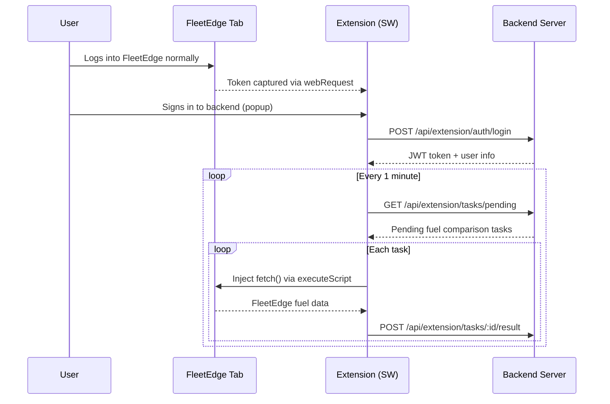
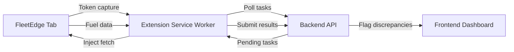

# FleetEdge Fuel Monitor — Chrome Extension

A Chrome Extension (Manifest V3) that passively captures FleetEdge authentication tokens from the user's browser session and uses them to fetch fuel consumption data on behalf of your backend. It replaces the Python/Playwright scraper entirely — no browser automation, no manual login scripts.

**API Calls via Tab Injection:** To work around Chrome's service-worker security model, the extension injects `fetch()` calls directly into the open FleetEdge browser tab. This ensures requests carry the correct `Origin: fleetedge.home.tatamotors` header and full session cookies — bypassing 403 Forbidden errors.

---

## How It Works

### High-Level Flow





**Key points:**
- The FleetEdge token never leaves the browser
- Only fuel consumption results are sent to your backend
- **The FleetEdge tab must stay open** in the browser for the extension to work
- Requests injected into the tab appear as legitimate FleetEdge portal requests

### Step-by-Step Detail

1. **Token Capture** — The extension listens to all requests going to `https://cvp.api.tatamotors/*` via Chrome's `webRequest` API. When it sees an `Authorization: Bearer <jwt>` header, it saves the token and decodes the `fleet_id` from the JWT payload. This happens passively whenever the user is browsing FleetEdge.

2. **Task Polling** — A Chrome alarm fires every 1 minute (configurable). The extension calls `GET /api/extension/tasks/pending` on the backend to get a list of vehicles + time ranges that need fuel data.

3. **Tab Injection** — All FleetEdge API calls use `chrome.scripting.executeScript` to run inside the open FleetEdge browser tab. This bypasses Chrome's restriction on service-worker Origin headers.

4. **VIN Resolution** — Your backend sends vehicle registration numbers (e.g. `MH12AB1234`). FleetEdge APIs need VINs. The extension calls FleetEdge's `/get-vin-for-dashboard` endpoint (injected into the tab), builds a `registration → VIN` map, and caches it for 24 hours.

5. **Time Conversion** — Your backend sends times in IST. FleetEdge APIs need UTC. The extension supports two modes:
   - **Explicit range** (recommended): send `from_date`, `from_time`, `to_date`, `to_time` — the extension converts each endpoint from IST to UTC directly.
   - **Point-in-time** (legacy): send `refuel_date`, `refuel_time` — the extension auto-builds a ±30 minute window around that point.

6. **Fuel Data Fetch** — For each task, the extension calls FleetEdge's `/analyse-fuel-consumption` endpoint (injected into the tab) with the VIN and UTC time window, plus `is_testing: true` and `data_count: 100` flags.

7. **Result Submission** — Results are POSTed back to your backend at `POST /tasks/:taskId/result`. If a task fails (VIN not found, API error, etc.), the error is reported to `POST /tasks/:taskId/error`.

8. **Manual Query** — Users can also fetch fuel data manually from the popup UI by entering a vehicle number/VIN and a date-time range. These results are sent to your backend at `POST /fuel-data/ingest`.

---

## Installation

```bash
cd extension
npm install
```

Create your environment file:

```bash
cp .env.example .env
```

Edit `.env`:

```env
VITE_BACKEND_BASE_URL=http://localhost:3000/api
```

Build:

```bash
npm run build
```

Load into Chrome:

1. Go to `chrome://extensions/`
2. Enable **Developer mode** (top-right toggle)
3. Click **Load unpacked** → select the `dist/` folder

### First-Time Setup

1. Click the extension icon → **Sign In** with your backend credentials (email/mobile + password)
2. Only OWNER, MANAGER, or SUPER_ADMIN roles can use the extension
3. Open FleetEdge in a new tab and log in normally
4. The extension captures the token automatically — you'll see a green badge ✓
5. The extension begins polling for tasks automatically after both logins are complete
6. Click **Poll Tasks Now** to test

---

## Backend Integration Guide

Your backend needs to implement **3 required endpoints** and **1 optional endpoint**. The extension communicates exclusively over JSON REST APIs with Bearer token auth.

### Authentication

Every request from the extension includes:

```
Authorization: Bearer <system_token>
Content-Type: application/json
```

The `system_token` is whatever token you configure in the extension popup settings. Your backend should validate it however you see fit (JWT verification, database lookup, etc.).

---

### Endpoint 1: `GET /tasks/pending` (Required)

The extension calls this every poll cycle to get work to do.

**What your backend should return:** A list of vehicles that need fuel consumption data fetched from FleetEdge. Each task specifies a vehicle and a time range.

**Response format — Explicit range (recommended):**

This is the recommended approach. You specify exactly which time window to query — like measuring a 100m sprint with a clear start and finish line.

```json
{
  "tasks": [
    {
      "id": "task_001",
      "vehicle_number": "MH12AB1234",
      "from_date": "2026-02-14",
      "from_time": "03:20",
      "to_date": "2026-02-18",
      "to_time": "14:50"
    }
  ]
}
```

This tells the extension: "get me fuel data for MH12AB1234 from **Feb 14 03:20 IST** to **Feb 18 14:50 IST**." The extension converts these to UTC (`2026-02-13T21:50:00.000` → `2026-02-18T09:20:00.000`) and queries FleetEdge with exact boundaries.

**Response format — Point-in-time (legacy):**

```json
{
  "tasks": [
    {
      "id": "task_002",
      "vehicle_number": "GJ01CD5678",
      "refuel_date": "2026-02-21",
      "refuel_time": "14:30"
    }
  ]
}
```

This tells the extension: "there was a refueling event at 14:30 IST, search ±30 minutes around it." The extension auto-builds the window: 14:00 → 15:00 IST. Less precise — use the explicit range format instead.

**You can mix both formats in the same response.** Each task is evaluated independently.

**Field requirements:**

| Field | Type | Format | Required | Description |
|-------|------|--------|----------|-------------|
| `id` | string | any unique ID | always | Used to submit results back. Must be unique per task. |
| `vehicle_number` | string | Registration number | always | e.g. `MH12AB1234`, `WB25R9640`. Spaces/hyphens stripped automatically. |
| `from_date` | string | `YYYY-MM-DD` | for explicit range | Start date in IST |
| `from_time` | string | `HH:MM` | for explicit range | Start time in IST (24hr) |
| `to_date` | string | `YYYY-MM-DD` | for explicit range | End date in IST |
| `to_time` | string | `HH:MM` | for explicit range | End time in IST (24hr) |
| `refuel_date` | string | `YYYY-MM-DD` | for point-in-time | Refuel event date in IST |
| `refuel_time` | string | `HH:MM` | for point-in-time | Refuel event time in IST (24hr) |

**Priority:** If a task has both explicit range fields AND refuel fields, the explicit range wins.

**Important notes:**
- Return an empty `tasks` array (`[]`) when there's nothing to process — not `null` or missing field.
- Only return tasks with `status: "pending"` — the extension does not track state internally.
- The extension validates required fields. Tasks missing fields are skipped with an error report to `POST /tasks/:taskId/error`.

**Example backend implementation (Express.js):**

```javascript
app.get('/api/tasks/pending', authMiddleware, async (req, res) => {
  const tasks = await db.collection('refuel_tasks').find({
    status: 'pending'
  }).toArray();

  res.json({
    tasks: tasks.map(t => ({
      id: t._id.toString(),
      vehicle_number: t.vehicle_number,
      from_date: t.from_date,
      from_time: t.from_time,
      to_date: t.to_date,
      to_time: t.to_time,
    }))
  });
});
```

---

### Endpoint 2: `POST /tasks/:taskId/result` (Required)

The extension calls this after successfully fetching fuel data for a task.

**What the extension sends you:**

```json
{
  "task_id": "task_001",
  "results": [
    {
      "vin": "MAT828113S2C05629",
      "registration_number": "MH12AB1234",
      "fuel_used": 45.2,
      "distance_covered": 320.5,
      "avg_speed": 42.3,
      "max_speed": 85.0,
      "idle_duration": 7200,
      "running_duration": 27400,
      "stoppage_duration": 3600,
      "mileage": 7.09
    }
  ],
  "submitted_at": "2026-02-21T09:45:12.345Z"
}
```

**What each field means:**

| Field | Type | Description |
|-------|------|-------------|
| `task_id` | string | Same ID you sent in `/tasks/pending` |
| `results` | array | Fuel consumption records from FleetEdge. May be **empty** (`[]`) if FleetEdge had no data for that time window. |
| `submitted_at` | string (ISO 8601) | When the extension submitted this result |

**The `results` array** contains raw data from FleetEdge's `/analyse-fuel-consumption` API. The exact fields depend on FleetEdge's response schema, but typically include:

- `vin` — Vehicle Identification Number
- `registration_number` — Vehicle registration
- `fuel_used` — Fuel consumed (litres)
- `distance_covered` — Distance driven (km)
- `avg_speed` — Average speed (km/h)
- `max_speed` — Maximum speed (km/h)
- `idle_duration` — Idle time (seconds)
- `running_duration` — Running time (seconds)
- `stoppage_duration` — Stoppage time (seconds)
- `mileage` — Fuel efficiency (km/l)

**Your backend should:**
1. Store the results in your database
2. Mark the task as `status: "completed"`
3. Return a success response

**Expected response:**

```json
{
  "success": true
}
```

**Example backend implementation:**

```javascript
app.post('/api/tasks/:taskId/result', authMiddleware, async (req, res) => {
  const { taskId } = req.params;
  const { task_id, results, submitted_at } = req.body;

  // Store the fuel data
  if (results.length > 0) {
    await db.collection('fuel_consumption_data').insertMany(
      results.map(r => ({
        task_id: taskId,
        ...r,
        submitted_at: new Date(submitted_at),
        created_at: new Date(),
      }))
    );
  }

  // Mark task as done
  await db.collection('refuel_tasks').updateOne(
    { _id: new ObjectId(taskId) },
    { $set: { status: 'completed', completed_at: new Date() } }
  );

  res.json({ success: true });
});
```

---

### Endpoint 3: `POST /tasks/:taskId/error` (Required)

The extension calls this when a task fails (VIN not found, FleetEdge API error, etc.).

**What the extension sends you:**

```json
{
  "task_id": "task_001",
  "error": "VIN not found for registration: MH12AB1234",
  "reported_at": "2026-02-21T09:45:12.345Z"
}
```

**Common error messages:**

| Error | Meaning | What to Do |
|-------|---------|------------|
| `VIN not found for registration: <reg>` | Registration number doesn't exist in FleetEdge's vehicle list | Check the registration number is correct |
| `Session expired` | FleetEdge token expired mid-batch | User needs to log into FleetEdge again |
| `missing time fields — provide either (from_date + ...)` | Task has neither explicit range nor refuel point fields | Send one of the two time formats |
| `missing vehicle_number` | Task has no `vehicle_number` field | Ensure every task has a vehicle registration |
| `FleetEdge API returned 403` | FleetEdge blocked the request | Possible rate limiting, will retry next cycle |

**Your backend should:**
1. Log the error
2. Mark the task as `status: "failed"` (or `status: "retry"` if you want the extension to pick it up again next cycle)
3. Return a success response

**Expected response:**

```json
{
  "success": true
}
```

**Example backend implementation:**

```javascript
app.post('/api/tasks/:taskId/error', authMiddleware, async (req, res) => {
  const { taskId } = req.params;
  const { error, reported_at } = req.body;

  await db.collection('refuel_tasks').updateOne(
    { _id: new ObjectId(taskId) },
    {
      $set: {
        status: 'failed',
        last_error: error,
        error_at: new Date(reported_at),
      }
    }
  );

  res.json({ success: true });
});
```

---

### Endpoint 4: `POST /fuel-data/ingest` (Optional)

This endpoint receives results from **manual queries** made through the extension popup. It's separate from the task-based flow — the user manually enters a vehicle and date range, and the extension sends the full result here.

**What the extension sends you:**

```json
{
  "source": "manual_query",
  "vin": "MAT828113S2C05629",
  "registration": "MH12AB1234",
  "identifier": "MH12AB1234",
  "fleetId": "fleet-abc-123",
  "fromIst": "2026-02-20 08:00",
  "toIst": "2026-02-21 18:00",
  "fromUtc": "2026-02-20T02:30:00.000Z",
  "toUtc": "2026-02-21T12:30:00.000Z",
  "fetchedAt": "2026-02-21T09:45:12.345Z",
  "resultCount": 3,
  "results": [
    {
      "vin": "MAT828113S2C05629",
      "fuel_used": 45.2,
      "distance_covered": 320.5
    }
  ],
  "rawResponse": {}
}
```

| Field | Description |
|-------|-------------|
| `source` | Always `"manual_query"` — distinguishes from automated task results |
| `vin` | Resolved VIN |
| `registration` | Registration number (null if user entered a VIN directly) |
| `identifier` | Exactly what the user typed |
| `fromIst` / `toIst` | The IST time range the user selected |
| `fromUtc` / `toUtc` | The UTC-converted time range sent to FleetEdge |
| `results` | Fuel consumption data array (same schema as task results) |
| `rawResponse` | The complete unmodified FleetEdge API response |

If this endpoint is not configured or unreachable, manual query results are still stored locally in the extension and visible in the popup. Nothing breaks.

---

### CORS Configuration

Your backend must allow requests from Chrome extensions:

```javascript
const cors = require('cors');

app.use(cors({
  origin: [
    /^chrome-extension:\/\//,   // All extension origins
    'http://localhost:5173',     // Vite dev server
  ],
  credentials: true,
}));
```

---

### Suggested Database Schema (MongoDB)

```javascript
// refuel_tasks collection
{
  _id: ObjectId,
  vehicle_number: "MH12AB1234",       // Registration number
  from_date: "2026-02-14",            // IST start date  (explicit range)
  from_time: "03:20",                 // IST start time
  to_date: "2026-02-18",              // IST end date
  to_time: "14:50",                   // IST end time
  // OR for legacy point-in-time:
  // refuel_date: "2026-02-21",
  // refuel_time: "14:30",
  status: "pending",                   // pending | completed | failed
  created_at: ISODate,
  completed_at: ISODate,              // Set when extension submits result
  last_error: "VIN not found...",     // Set when extension reports error
  error_at: ISODate,
}

// fuel_consumption_data collection
{
  _id: ObjectId,
  task_id: "task_001",
  vin: "MAT828113S2C05629",
  registration_number: "MH12AB1234",
  fuel_used: 45.2,
  distance_covered: 320.5,
  avg_speed: 42.3,
  max_speed: 85.0,
  idle_duration: 7200,
  running_duration: 27400,
  stoppage_duration: 3600,
  mileage: 7.09,
  submitted_at: ISODate,
  created_at: ISODate,
  source: "task",                      // "task" or "manual_query"
}
```

---

## Environment Variables

All configured in `.env` (copy from `.env.example`):

| Variable | Default | Description |
|----------|---------|-------------|
| `VITE_BACKEND_BASE_URL` | — | **Required.** Your backend API URL (e.g. `http://localhost:3000/api`) |
| `VITE_POLL_INTERVAL_MINUTES` | `5` | How often to check for new tasks |
| `VITE_INTER_TASK_DELAY_MS` | `500` | Delay between processing tasks (avoids rate limiting) |
| `VITE_VIN_CACHE_TTL_HOURS` | `24` | How long to cache the vehicle registration → VIN map |
| `VITE_TOKEN_EXPIRY_BUFFER_SECONDS` | `60` | Stop processing this many seconds before token expires |
| `VITE_SEARCH_WINDOW_MINUTES` | `30` | Minutes before/after refuel point for legacy tasks (not used with explicit range) |
| `VITE_LOG_RETENTION_COUNT` | `500` | Max log entries kept in storage |
| `VITE_MAX_RETRY_ATTEMPTS` | `2` | Retries on transient API failures (exponential backoff: 1s → 2s → 4s) |

---

## Project Structure

```
extension/
├── src/
│   ├── main.jsx                      # Popup entry point
│   ├── index.css                     # Global styles
│   ├── background/
│   │   ├── index.js                  # Service worker entry, message router
│   │   ├── tokenCapture.js           # Intercepts FleetEdge Bearer tokens
│   │   ├── taskPoller.js             # Alarm-based polling + task processing
│   │   ├── fleetedgeApi.js           # FleetEdge API client (get-vehicles, fuel consumption)
│   │   ├── backendApi.js             # Your backend API client (tasks, results, errors)
│   │   ├── config.js                 # Loads environment variables
│   │   ├── logger.js                 # Batched logging (buffer → flush every 2s)
│   │   ├── utils.js                  # JWT decode, IST→UTC, retry, metrics
│   │   └── __tests__/               # Vitest unit tests (47 tests)
│   └── popup/
│       ├── Popup.jsx                 # React popup UI (status, settings, manual query)
│       └── Popup.css                 # Popup styles
├── public/icons/                     # Extension icons (16, 48, 128px)
├── manifest.json                     # Chrome MV3 manifest
├── vite.config.js                    # Build config (@crxjs/vite-plugin)
├── .env.example                      # Environment template
└── package.json
```

---

## Development

```bash
npm run dev     # Vite dev server with hot reload
npm run build   # Production build → dist/
npm test        # Run all 47 unit tests
```

When running `npm run dev`, load the extension from the project root (not `dist/`). Popup UI changes hot-reload. Background service worker changes require clicking the refresh icon on `chrome://extensions/`.

---

## Troubleshooting

| Problem | Solution |
|---------|----------|
| Token not capturing | Navigate to FleetEdge's Reports section — the extension needs to see at least one API request with a Bearer header |
| Token shows "Expired" | Log into FleetEdge again in any tab. The extension captures the new token automatically |
| Vehicle count is 0 | Click **Refresh Vehicles** in the popup. Check that the FleetEdge token is valid |
| Tasks not processing | Verify backend URL and token are set in Settings. Check service worker console (`chrome://extensions/` → "service worker" link) |
| Build fails | Delete `node_modules` + `package-lock.json`, run `npm install`. Requires Node.js 18+ |

---

## Security

- **FleetEdge token** is stored in `chrome.storage.local` and **never sent to your backend**
- **Backend token** is only sent to your own backend URL
- Fuel results are sent immediately and not stored long-term (only the last manual query result is cached locally)
- The extension requests `webRequest` permission solely to read Authorization headers from FleetEdge requests

