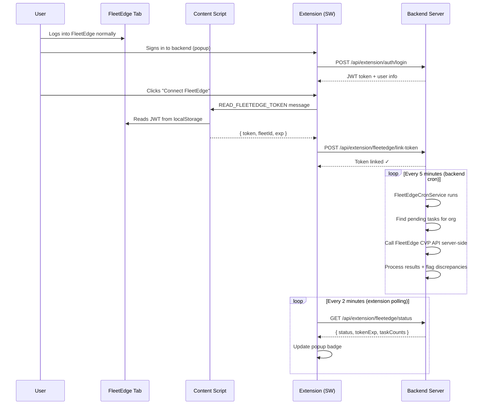
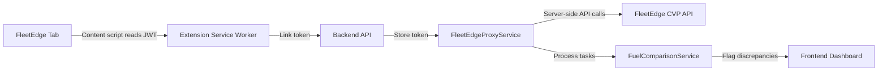

# FleetEdge Fuel Monitor — Chrome Extension v2.0.0

A CWS-compliant Chrome Extension (Manifest V3) that connects to the FleetEdge portal to share authentication tokens with your backend. The backend handles all FleetEdge API calls server-side — the extension acts as a thin status display and token provider.

**Backend Direct Architecture (v2.0.0):** All FleetEdge API calls are made by the backend's `FleetEdgeProxyService`. The extension only reads the FleetEdge JWT from localStorage via a declared content script and sends it to the backend. No `webRequest`, `scripting`, or `tabs` permissions required.

---

## How It Works

### High-Level Flow





**Key points:**
- The FleetEdge token is read by a **declared content script** (CWS-compliant)
- The token is sent to your backend for server-side use
- **All FleetEdge API calls happen on the backend** — not in the browser
- The extension has minimal permissions: `storage`, `alarms`, `notifications`
- The FleetEdge tab does NOT need to stay open after token linking

### Step-by-Step Detail

1. **Token Reading** — We leverage Manifest V3's official `world: "MAIN"` execution environment. A stealth script (`networkSpy.js`) runs natively in the FleetEdge page context to intercept `window.fetch` and `XMLHttpRequest`. When the Single Page Application makes a request, the spy grabs the live `Authorization` header mid-flight and securely passes it to our isolated extension script (`fleetedgeTokenReader.js`) via `window.postMessage`. This completely bypasses any localStorage obfuscation while maintaining 100% CWS compliance (no string evaluation).

2. **Token Linking** — The service worker sends the discovered token to `POST /api/extension/fleetedge/link-token`. The backend validates the token against the FleetEdge CVP API before storing it, and fetches the FleetEdge user profile (`get-user-document-master`) to give the account a human-readable name (e.g. "Ajit Kumar Singh (user@email.com)"). If validation fails, the token is rejected. If the content script is not yet injected when "Connect FleetEdge" is clicked (e.g. the tab just loaded), the extension automatically reloads the FleetEdge tab, waits 3 seconds for injection, and retries once before reporting an error.

3. **Backend Task Processing** — A cron job (`FleetEdgeCronService`) runs every 5 minutes. For each organization with a linked FleetEdge token, it:
   - Finds all pending fuel comparison tasks
   - Fetches the vehicle VIN map from FleetEdge
   - Calls FleetEdge's `/analyse-fuel-consumption` API for each task
   - Processes results through `FuelComparisonService`
   - Marks tasks as completed or failed

4. **Status Polling** — The extension polls `GET /api/extension/fleetedge/status` every 2 minutes via `chrome.alarms` to display connection status and task counts in the popup.

5. **Manual Trigger** — Users can click "Process Tasks Now" in the popup to trigger `POST /api/extension/fleetedge/process-tasks` immediately — useful for testing or urgent processing.

6. **Token Expiry** — FleetEdge tokens expire after ~24 hours. The backend checks expiry before each use and returns `expired` status. The extension prompts the user to reconnect.

---

## Installation

```bash
cd extension
npm install
```

Build:

```bash
npm run build
```

Load into Chrome:

1. Go to `chrome://extensions/`
2. Enable **Developer mode** (top-right toggle)
3. Click **Load unpacked** → select the `dist/` folder

### First-Time Setup

1. Click the extension icon → **Sign In** with your backend credentials (email/mobile + password)
2. Only OWNER, MANAGER, or SUPER_ADMIN roles can use the extension
3. Open FleetEdge in a tab and log in normally
4. Click **Connect FleetEdge** in the extension popup
5. The extension reads the token and links it to your backend account
6. The backend starts processing tasks automatically every 5 minutes
7. Click **Process Tasks Now** to test immediately

---

## Backend Integration Guide

The extension communicates with your backend over JSON REST APIs with Bearer token auth. The backend handles all FleetEdge interactions autonomously.

### Authentication

Every request from the extension includes:

```
Authorization: Bearer <backend_jwt>
Content-Type: application/json
```

### FleetEdge Proxy Endpoints

These endpoints manage the FleetEdge connection:

| Method | Endpoint | Description |
|--------|----------|-------------|
| POST | `/api/extension/fleetedge/link-token` | Link a FleetEdge token to the user |
| GET | `/api/extension/fleetedge/status` | Get connection status + task counts |
| POST | `/api/extension/fleetedge/unlink` | Unlink FleetEdge token |
| POST | `/api/extension/fleetedge/fetch-vehicles` | Fetch vehicles (on-demand) |
| POST | `/api/extension/fleetedge/process-tasks` | Trigger task processing now |

#### POST `/fleetedge/link-token`

```json
// Request
{ "token": "<jwt>", "fleetId": "U17380935682118922260" }

// Response (200)
{ "data": { "status": "linked", "fleetId": "U17380935682118922260", "tokenExp": 1773279972 } }

// Response (400) — invalid token
{ "message": "FleetEdge token validation failed — token may be expired or invalid" }
```

#### GET `/fleetedge/status`

```json
// Response (200)
{
  "data": {
    "status": "linked",          // "linked" | "expired" | "unlinked"
    "fleetId": "U17380935682118922260",
    "tokenExp": 1773279972,
    "linkedAt": "2026-03-10T12:00:00.000Z"
  }
}
```

#### POST `/fleetedge/process-tasks`

```json
// Response (200)
{
  "data": {
    "processed": 5,
    "succeeded": 4,
    "failed": 1,
    "errors": ["VIN not found for WB99X0000"]
  }
}
```

### Existing Extension Endpoints

These endpoints remain unchanged from v1:

| Method | Endpoint | Description |
|--------|----------|-------------|
| POST | `/api/extension/auth/login` | Login with email/mobile + password |
| GET | `/api/extension/vehicles` | List organization vehicles |
| GET | `/api/extension/status` | Backend status + task counts |
| POST | `/api/extension/telemetry/ingest` | LEMU telemetry event ingestion |

### CORS Configuration

```javascript
const cors = require('cors');

app.use(cors({
  origin: [
    /^chrome-extension:\/\//,   // All extension origins
    'http://localhost:5173',     // Vite dev server
  ],
  credentials: true,
}));
```

---

## Chrome Web Store Compliance (v2.0.0)

The v2.0.0 refactoring was specifically designed for CWS compliance:

| Requirement | How We Comply |
|-------------|---------------|
| No `webRequest` for token interception | Content script reads from localStorage (declared in manifest) |
| No `scripting` for tab injection | Backend calls FleetEdge APIs server-side |
| No `tabs` permission | Not needed — content script is auto-injected by Chrome |
| Minimal `host_permissions` | Only `http://localhost:*/*` (for backend) |
| Content script must be declared | `content_scripts` in manifest.json, not programmatic injection |

### Permissions

```json
{
  "permissions": ["storage", "alarms", "notifications"],
  "host_permissions": ["http://localhost:*/*"],
  "content_scripts": [
    {
      "matches": ["https://fleetedge.home.tatamotors/*"],
      "js": ["src/content/networkSpy.js"],
      "run_at": "document_start",
      "world": "MAIN"
    },
    {
      "matches": ["https://fleetedge.home.tatamotors/*"],
      "js": ["src/content/fleetedgeTokenReader.js"],
      "run_at": "document_idle",
      "world": "ISOLATED"
    }
  ]
}
```

---

## Project Structure

```
extension/
├── src/
│   ├── main.jsx                      # Popup entry point
│   ├── index.css                     # Global styles
│   ├── background/
│   │   ├── index.js                  # Service worker entry, message router
│   │   ├── fleetedgeLink.js          # FleetEdge token link flow (content script → backend)
│   │   ├── backendApi.js             # Backend API client (auth, status, vehicles)
│   │   ├── config.js                 # Configuration constants
│   │   ├── logger.js                 # Batched logging (buffer → flush every 2s)
│   │   ├── telemetry.js              # LEMU telemetry (7-layer logger)
│   │   ├── utils.js                  # JWT decode, IST→UTC, retry, metrics
│   │   └── __tests__/               # Vitest unit tests (187 tests)
│   ├── content/
│   │   └── fleetedgeTokenReader.js   # Declared content script (reads FleetEdge JWT)
│   └── popup/
│       ├── Popup.jsx                 # React popup UI (status, settings, FleetEdge link)
│       └── Popup.css                 # Popup styles
├── public/icons/                     # Extension icons (16, 48, 128px)
├── manifest.json                     # Chrome MV3 manifest
├── vite.config.js                    # Build config (@crxjs/vite-plugin)
└── package.json
```

---

## Development

```bash
npm run dev     # Vite dev server with hot reload
npm run build   # Production build → dist/
npx vitest run  # Run all 153 unit tests
```

When running `npm run dev`, load the extension from the project root (not `dist/`). Popup UI changes hot-reload. Background service worker changes require clicking the refresh icon on `chrome://extensions/`.

---

## Troubleshooting

| Problem | Solution |
|---------|----------|
| "Connect FleetEdge" fails | Open FleetEdge in a tab and log in first. If the tab just loaded, the extension will auto-refresh it and retry — wait a few seconds and try again |
| Status shows "Expired" | Log into FleetEdge again in any tab, then click "Connect FleetEdge" to re-link |
| Tasks not processing | Check backend logs. The cron runs every 5 minutes. Click "Process Tasks Now" to trigger immediately |
| Vehicle count is 0 | Backend fetches vehicles via FleetEdge proxy. Check FleetEdge token is linked and valid |
| Build fails | Delete `node_modules` + `package-lock.json`, run `npm install`. Requires Node.js 18+ |

---

## Security

- **FleetEdge token** is read by a declared content script and sent to the backend via HTTPS
- **Backend token** is only sent to your configured backend URL
- The content script only runs on `fleetedge.home.tatamotors` — cannot read data from other sites
- The extension requests **no sensitive permissions** (no webRequest, scripting, tabs)
- All FleetEdge API calls happen server-side with proper auth headers

---

## Migration from v1.x

v2.0.0 is a breaking architectural change. Key differences:

| Feature | v1.x | v2.0.0 |
|---------|------|--------|
| FleetEdge API calls | Extension (tab injection) | Backend (server-side) |
| Token capture | `webRequest` listener | Declared content script |
| Task processing | Extension polls + processes | Backend cron (5 min) |
| Permissions needed | `webRequest`, `scripting`, `tabs` | `storage`, `alarms`, `notifications` |
| FleetEdge tab required | Must stay open always | Only needed during "Connect" |
| Manual query | In popup (inject fetch) | Removed (backend handles all) |
| CWS compliant | No | **Yes** |

**Deleted files from v1.x:**
- `tokenCapture.js` — Replaced by declared content script
- `fleetedgeApi.js` — Replaced by `FleetEdgeProxyService` (backend)
- `taskPoller.js` — Replaced by `FleetEdgeCronService` (backend)
